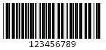

# React Code39 Barcode

This is a lightweight React component that allows you to render Code39 barcodes as SVG. It is designed to be used on the client or server side, making it ideal for generating a large number of Code39 barcodes.

## Supported Code

- CODE39

## Example


## Installation

To install the React Code39 Barcode component, simply run the following command:

```
npm install react-code39-barcode
```

## Usage

To use the React Code39 Barcode component, import it into your project and pass the desired barcode value as a prop. Here's an example:

```jsx
import React from 'react';
import { Barcode39Svg } from 'react-code39-barcode';

const App = () => {
  return (
    <div>
      <h1>Code39 Barcode Example</h1>
      <Barcode39Svg value='123456789' />
    </div>
  );
};

export default App;
```

## Props

| Prop        | Type    | Default     | Description                                                                   |
| ----------- | ------- | ----------- | ----------------------------------------------------------------------------- |
| value       | string  | -           | The value to be encoded as a Code39 barcode.                                  |
| width       | number  | 1           | The width of each bar in pixels.                                              |
| height      | number  | 60          | The height of the barcode in pixels.                                          |
| fontSize    | number  | 16          | The font size of the text displayed below the barcode.                        |
| fontFamily  | string  | 'monospace' | The CSS font family of the text displayed below the barcode.                  |
| fontWeight  | string  | '500'       | The CSS font weight of the text displayed below the barcode.                  |
| color       | string  | "black"     | The color of the barcode.                                                     |
| textColor   | string  | "black"     | The color of the text displayed below the barcode if different from the color |
| showText    | boolean | true        | Whether to display the text below the barcode.                                |
| lineSpacing | number  | 10          | The spacing between the display text and the barcode.                         |
| className   | string  | ""          | Any valid css class that will be applied to the barcode container             |
| id          | string  | ""          | HTML id for the barcode container                                             |

The table above lists the props that can be passed to the `Barcode39Svg` component. Each prop has a corresponding type, default value, and description.

Please note that the `value` prop is required and must be a string representing the value to be encoded as a Code39 barcode. The other props are optional and have default values specified in the table.

Feel free to modify these props according to your requirements.

## Performance

This library was specifically created to address the performance issues found in other Code39 barcode generation libraries. By being lightweight and optimized for server-side usage, it ensures fast and efficient barcode rendering.

## Contributing

Contributions are welcome! If you encounter any issues or have suggestions for improvements, please feel free to open an issue or submit a pull request on the [GitHub repository](https://github.com/your-repo-link).

## License

This project is licensed under the [MIT License](https://opensource.org/licenses/MIT).
